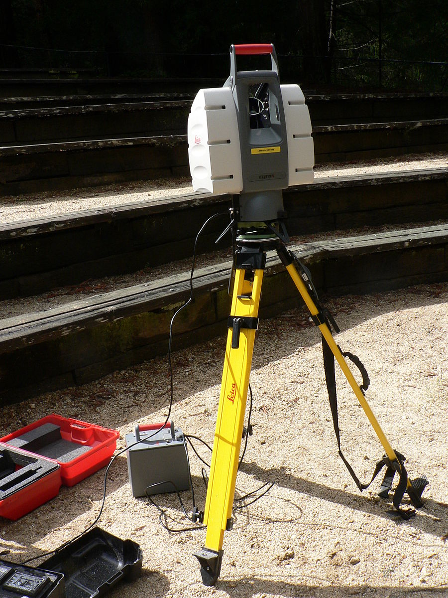

class: inverse, center, middle
```{r xaringan-themer, include=FALSE, warning=FALSE}
library(xaringanthemer)
style_mono_accent(
  base_color = "#1c5253",
  #header_font_google = google_font("Josefin Sans"),
  #text_font_google   = google_font("Montserrat", "300", "300i"),
  #code_font_google   = google_font("Fira Mono")
)

#style_mono_light(base_color = "#23395b")
```


# Summary

General description

Technology

---
```{r echo=FALSE}
library(RefManageR)
BibOptions(check.entries = FALSE,
           bib.style = "authoryear",
           cite.style = "authoryear",
           style = "markdown",
           hyperlink = TRUE,
           dashed = FALSE,
           no.print.fields=c("doi", "url", "urldate", "issn"))
myBib <- ReadBib("./Library.bib", check = FALSE)
```

# General description 
**LiDAR**: an acronym of "**L**aser **I**maging, **D**etection, **A**nd **R**anging"

.pull-left[
* A method for determining ranges by targeting an object or a surface with a laser and measuring the time for the reflected light to return to the receiver `r Citep(myBib, "shan2018")`. 

* Use ultraviolet, visible, or near infrared light

* Advantages: target a **wide range of materials** `r Citep(myBib,"cracknell2007")` with **high resolution**

]

.pull-right[
```{r echo=FALSE, out.width='70%', fig.align='center'}

```

.small[Leica terrestrial lidar scanner (TLS). Source: [David Monniaux](https://en.wikipedia.org/wiki/File:Lidar_P1270901.jpg)]
]

---
# Technology


---
class: inverse, center, middle
# Application
Category
Example

---
# Category


---
# Example


---
class: inverse, center, middle
# Reflection


---
# 


---
# Reference

```{r results='asis', echo=FALSE}
PrintBibliography(myBib, start = 1, end = 7)
```

