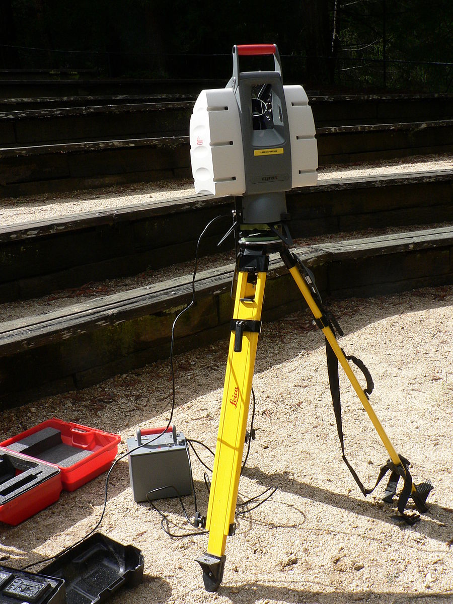

class: inverse, center, middle
```{r xaringan-themer, include=FALSE, warning=FALSE}
library(xaringanthemer)
style_mono_accent(
  base_color = "#1c5253",
  #header_font_google = google_font("Josefin Sans"),
  #text_font_google   = google_font("Montserrat", "300", "300i"),
  #code_font_google   = google_font("Fira Mono")
)

#style_mono_light(base_color = "#23395b")
```
# Summary

General description

Technology

---
## General description 
**LiDAR**: an acronym of "**Li**ght **D**etection, **A**nd **R**anging"
```{r echo=FALSE}
library(RefManageR)
BibOptions(check.entries = FALSE,
           bib.style = "authoryear",
           cite.style = "authoryear",
           style = "markdown",
           hyperlink = TRUE,
           dashed = FALSE,
           no.print.fields=c("doi", "url", "urldate", "issn"))
myBib <- ReadBib("./Library.bib", check = FALSE)
```
.pull-left[
* A method for determining ranges by targeting an object or a surface with a laser and measuring the time for the reflected light to return to the receiver `r Citep(myBib, "shan2018")`. 

* Use ultraviolet, visible, or near infrared light

* Advantages: target a **wide range of materials** `r Citep(myBib,"cracknell2007")` with **high resolution**

]

.pull-right[
```{r echo=FALSE, out.width='70%', fig.align='center'}

```

.small[Leica terrestrial lidar scanner (TLS). Source: [David Monniaux](https://en.wikipedia.org/wiki/File:Lidar_P1270901.jpg)]
]

---
## Technology
.pull-left[
### Mathematical formula
$$distance= \frac{c*t}{2}$$

.small[c: speed of light; 

t: the time spent for the laser light to travel and travel back between the object and the detector.]
]

.pull-right[

```{r echo=FALSE, out.width='60%', fig.align='center'}

```

.small[Basic time-of-flight principles applied to laser range-finding. Source: [RCraig09](https://en.wikipedia.org/wiki/File:20200501_Time_of_flight.svg)]
]

###  Two kinds of lidar detection schemes

* **direct energy detection**: principally measures amplitude changes of the reflected light, more simple
* **coherent detection**: best for measuring Doppler shifts, or changes in the phase of the reflected light, more sensitive
---
class: inverse, center, middle
# Application

Category

Example

---
## Category

* **Airborne**

  * Creates a 3-D point cloud model of landscape when attached to an aircraft during flight
  * Most detailed and accurate method, can filter out reflections of vegetation from the point cloud model
  
* **Terrestrial**

  * Happen on the Earth's surface and can be either stationary or mobile
.pull-left[
```{r echo=FALSE, out.width='80%', fig.align='center'}

```
.small[Airborne: High-resolution multibeam lidar map. Source: [NOAA Ocean Exploration & Research](https://www.flickr.com/photos/oceanexplorergov/9267768683/)]
]
.pull-right[
```{r echo=FALSE, out.width='75%', fig.align='center'}

```
.small[Terrestrial: LIDAR equipped mobile robot. Source: [S. Winkvist](https://en.wikipedia.org/wiki/File:LIDAR_equipped_mobile_robot.jpg)]

]

---
## Example of Airborne LiDAR applications

* Urban morphology and green analysis
  * `r Citet(myBib, "yu2010")` applied airborne LiDAR technology on building density information.
  * `r Citet(myBib, "hecht2008")` estimated the urban green volume using single pulse LiDAR-derived nDSM.
  
* Urban flood risk modeling
  * `r Citet(myBib,"tsubaki2010")` generated unstructured grid representing the urban landscape and estimated the water depth by flood simulations.
.pull-left[
```{r echo=FALSE, out.width='88%', fig.align='center'}

```
.small[Extracted building objects and its coverage ratio map for Houston. Source: `r Citet(myBib, "yu2010")`]
]
.pull-right[
```{r echo=FALSE, out.width='90%', fig.align='center'}

```
.small[Digital surface model and elevation model. Source: `r Citet(myBib,"tsubaki2010")`]
]
---
class: inverse, center, middle
# Reflection

---
## Reflection

### LiDAR's Role on planning
* Extraction building information, such as density, heights, volumes, boundary, coverage ratio, and floor area ratio, can be used to **estimate population**, which is helpful for strategy planning, urban design and policy analysis.
* Assessment of potential flood can be applied in **infrastructure planning** and the construction of **spong city**.
* Estimation of urban green volume provides information for **ecologically orientated** city planning and environmentally sustainable development.

### Future investigation
* Fine-scale land use information derived
* Air ventilation assessment (AVA) of urban environment *(especially in high rise built-up urban area)*
---
# Reference
```{r results='asis', echo=FALSE}
PrintBibliography(myBib, start = 1, end = 5)
```
